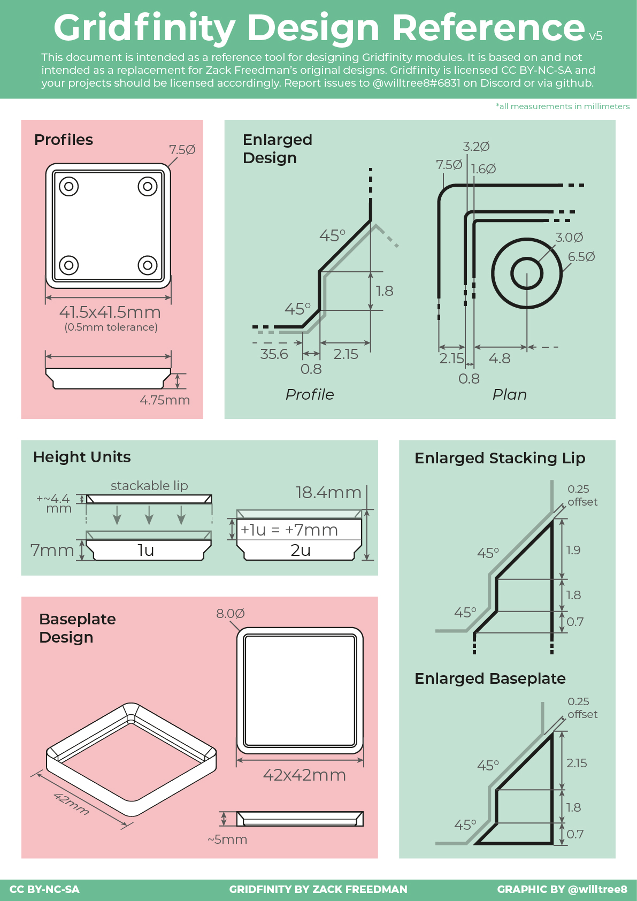

# Examples


Eleven scripts, from a plain catalogue of everything `Bin` can do to storage
cut to the shape of one specific tool. They divide into three groups:

- **Learning the API** -- `overview.py`.
- **Parametric generators** driven from the command line -- `bin.py`,
  `baseplate.py`, `screw_holes.py`, `sliding_lid_bin.py`.
- **One-off designs** shaped around a real object -- `pen_storage.py`,
  `pinecil_tip_storage.py`, `pinecil_soldering_iron_storage.py`,
  `engineer_ss_03_storage.py`, `PA-09_storage/PA-09_storage.py`,
  `solder-fume-fan.py`.

Building on a pitch other than 42 mm is covered separately, in
[Non-standard grid sizes](#non-standard-grid-sizes) at the end of this file.

Every design below is built by the same three-step recipe, and it is worth
seeing it once before reading the individual descriptions:

1. Build a solid that occupies the space the stored object needs.
1. Hand that solid to `gf.Bin` as `compartment`. It is subtracted from the bin
   body, positioned with its top at the top of the bin.
1. Export an STL.

The interesting work is always step 1. The library takes care of feet, walls and
stacking lip.

## Running the examples

Start the viewer, either the VS Code extension or standalone:

```shell
uv run -m ocp_vscode
```

Create the environment:

```shell
uv sync --python 3.12
```

`--python 3.12` is not optional. The lock requires `>=3.12` while
`pyproject.toml` carries no `requires-python`, so a bare `uv sync` picks
whatever `python` resolves to on `PATH` and fails if that is 3.14, for which no
`cadquery-ocp` wheel exists. 3.13 works too.

That sync also installs `gridfinity` itself into `.venv`, editable, because
`pyproject.toml` sets `[tool.uv] package = true`. No separate install step, and
nothing to redo after a later sync.

Then run a script:

```shell
uv run examples/overview.py
```

`solder-fume-fan.py` is the exception: its name contains a dash and it imports
from `examples.sliding_lid_bin`, so it must be run as a module from the
repository root:

```shell
uv run python -m examples.solder-fume-fan
```

Each section below ends with the script's complete source, copied verbatim
from the file, so the whole example can be read here without switching files.

The images were produced by `images/render_examples.py`, which executes each
script with the viewer stubbed out and projects the object the script itself
built. They cannot drift away from the code they illustrate.

## overview.py

A catalogue rather than a design: ten bins, each `show()`n, demonstrating one
option at a time. Nothing is exported.


The script walks through the three arguments that shape a `Bin`:

- `compartment` and `stacking_lip` each accept `"default"`, `None`, or a part.
  `None` on the compartment gives a solid block; `None` on the lip gives a bin
  that will not have another stacked on it.
- `gf.Compartment(grid, 2 * 7, wall_thickness=2.6)` shows the plain cavity with
  a thicker wall than the 1.0 mm default.
- `gf.extra.SubdividedCompartment` adds divisions, labels and scoops.
- The last three bins vary only the grid: a 3x5 rectangle, a G-shaped layout
  with a hole in it, and that same G-shape with a 4x4 subdivided compartment.

One convention recurs in every later example and is worth taking from here: a
compartment is normally `height - 7`, one unit shorter than the bin. That
leaves the bottom unit solid, which is where the Gridfinity feet live and where
screw or magnet holes are cut later.

The G-shaped grid also makes the point that a grid is a list of rows of
booleans, not a width and a depth. Rows may be ragged and `False` leaves a
hole.

### Source

`examples/overview.py`

```python
from ocp_vscode import show

import gridfinity as gf

# A basic 1x1 bin
grid_1x1 = [[True]]
bin_1x1 = gf.Bin(grid=grid_1x1, height=3 * 7)
show(bin_1x1)

# A 1x1 bin without stacking lip
bin_1x1_wo_lip = gf.Bin(grid=grid_1x1, height=3 * 7, stacking_lip=None)
show(bin_1x1_wo_lip)

# A 1x1 bin without compartment (i.e. filled)
bin_1x1_filled = gf.Bin(grid=grid_1x1, height=3 * 7, compartment=None)
show(bin_1x1_filled)

# A 1x1 bin without stacking lip and compartment
bin_1x1_filled_wo_lip = gf.Bin(
    grid=grid_1x1, height=3 * 7, stacking_lip=None, compartment=None
)
show(bin_1x1_filled_wo_lip)

# A container with a compartment with thick walls
bin_1x1_thick_walls = gf.Bin(
    grid=grid_1x1,
    height=3 * 7,
    compartment=gf.Compartment(
        grid_1x1,  # use same grid
        2 * 7,  # height of bin minus 1 unit (i.e. 7 mm)
        wall_thickness=2.6,
    ),
)
show(bin_1x1_thick_walls)

# A 1x1 bin with a subdivided compartment
bin_1x1_div2x2 = gf.Bin(
    grid=grid_1x1,
    height=3 * 7,
    compartment=gf.extra.SubdividedCompartment(
        grid_1x1,  # use same grid
        height=3 * 7 - 7,  # height of bin minus 1 unit (i.e. 7 mm)
        div_x=1,
        div_y=2,
    ),
)
show(bin_1x1_div2x2)

# A 1x1 bin with a subdivided compartment with scoop & label
bin_1x1_div2x2_scoop_label = gf.Bin(
    grid=grid_1x1,
    height=3 * 7,
    compartment=gf.extra.SubdividedCompartment(
        grid_1x1,  # use same grid
        height=3 * 7 - 7,  # usually height of bin minus 1 unit (i.e. 7 mm)
        div_x=1,
        div_y=2,
        with_label=True,
        scoops=["back"],
    ),
)
show(bin_1x1_div2x2_scoop_label)


# A simple 3x5 bin
grid_3x5 = [
    [True, True, True],
    [True, True, True],
    [True, True, True],
    [True, True, True],
    [True, True, True],
]
# alternative notation: grid_3x5 = [[True]*3] * 5
bin_3x5 = gf.Bin(grid=grid_3x5, height=3 * 7)
show(bin_3x5)

# An irregularly shaped bin
grid_g_shaped = [
    [True, True, True],
    [True, False, True],
    [True, True, True],
    [False, False, True],
    [True, True, True],
]
bin_g_shaped = gf.Bin(grid=grid_g_shaped, height=3 * 7)
show(bin_g_shaped)

# Compartments in an irregularly shaped container
bin_g_shaped_compartment = gf.Bin(
    grid=grid_g_shaped,
    height=3 * 7,
    compartment=gf.extra.SubdividedCompartment(
        grid_g_shaped,  # same grid
        2 * 7,  # 1 unit (7 mm) smaller [maximum would be 2.3*7]
        div_x=4,
        div_y=4,
        scoops=["back"],
        with_label=True,
    ),
)
show(bin_g_shaped_compartment)
```

## bin.py

The general-purpose generator. Everything `SubdividedCompartment` can do,
exposed on the command line.


```shell
uv run examples/bin.py --grid 2x3 --height 4 --div 2x2 --label --scoops back
```

Design notes:

- `parse_size` turns `2x3` into a tuple and raises `argparse.ArgumentTypeError`
  on anything else, so a typo is reported by argparse rather than as a
  traceback.
- `grid = [[True] * args.grid[0]] * args.grid[1]` builds a full rectangle. The
  rows are the same list object repeated, which is harmless here because
  nothing mutates them.
- `height = args.height * 7` is the only place units are converted, and the
  compartment is `height - 7`, the convention from `overview.py`.
- `--preview` shows the bin in the viewer and exits without writing anything.
  Without it the script exports and never opens a viewer, which is what makes
  it usable from a shell loop.
- The output filename encodes every parameter that went into the model:
  `bin_2x3-h4_div2x2_label_scoop-back.stl`. A directory of these is
  self-documenting, which matters once a dozen variants exist.

### Source

`examples/bin.py`

```python
import argparse

from build123d import (
    export_stl,
)

import gridfinity as gf

if __name__ == "__main__":

    def parse_size(
        value: str,
    ):
        """Parses a size argument in the format [width]x[height]."""
        try:
            w, h = map(
                int,
                value.lower().split("x"),
            )
            return w, h
        except ValueError as e:
            raise argparse.ArgumentTypeError(
                f"Invalid format: '{value}'.Expected format: WxH (e.g., 2x3)"
            ) from e

    parser = argparse.ArgumentParser()
    parser.add_argument(
        "--grid",
        type=parse_size,
        default=(1, 1),
        help="Bin grid size in format WxH (e.g., 2x3)",
    )
    parser.add_argument(
        "--height",
        type=int,
        default=3,
        help="Bin height in units (i.e. 2 = 14 mm).",
    )
    parser.add_argument(
        "--div",
        type=parse_size,
        default=(1, 1),
        help="Compartment division in format XxY (e.g., 2x2)",
    )
    parser.add_argument(
        "--div-cutout-width",
        type=float,
        default=0,
        help="Size of cutout in dividing walls (default none)",
    )
    parser.add_argument(
        "--div-cutout-height",
        type=float,
        default=0,
        help="Size of cutout in dividing walls (default none)",
    )
    parser.add_argument(
        "--label",
        action="store_true",
    )
    parser.add_argument(
        "--scoops",
        nargs="*",
        choices=[
            "front",
            "back",
            "left",
            "right",
        ],
        help=(
            "Specify which sides should have scoops. "
            "Options: front, back, left, right"
        ),
    )
    parser.add_argument(
        "--scoop-radius",
        type=float,
        default=7,
        help="Radius of the scoop.",
    )
    parser.add_argument(
        "--preview",
        action="store_true",
    )

    args = parser.parse_args()

    grid = [[True] * args.grid[0]] * args.grid[1]
    height = args.height * 7

    bin = gf.Bin(
        grid=grid,
        height=height,
        compartment=gf.extra.SubdividedCompartment(
            grid,
            height - 7,
            div_x=args.div[0],
            div_y=args.div[1],
            div_cutout_width=args.div_cutout_width,
            div_cutout_height=args.div_cutout_height,
            with_label=args.label,
            scoops=args.scoops,
            scoop_radius=args.scoop_radius,
        ),
    )

    if args.preview:
        from ocp_vscode import (
            show,
        )

        show(bin)
        exit(0)

    scoop_str = "-".join(args.scoops) if args.scoops else None
    export_stl(
        bin,
        "bin"
        f"_{args.grid[0]}x{args.grid[1]}-h{args.height}"
        f"_div{args.div[0]}x{args.div[1]}"
        f"{f'_cutout-w{args.div_cutout_width}-h{args.div_cutout_height}' if args.div_cutout_width else ''}"
        f"{'_label' if args.label else ''}"
        f"{f'_scoop-{scoop_str}' if scoop_str else ''}"
        ".stl",
    )
```

## baseplate.py

The tray the bins sit in. The one script here that produces no bin at all.


```shell
uv run examples/baseplate.py --grid 3x2
```

`gf.Baseplate` does all the work; the script is the command-line wrapper around
it, built to the same shape as `bin.py` so the two feel alike: `parse_size` for
the `WxH` argument, `--preview` to show instead of export, and a filename that
records what was built.

The plate is 4.65 mm tall -- a 2.15 mm chamfer, 1.8 mm of vertical wall and a
0.7 mm bottom chamfer, straight from the Gridfinity specification. Each
occupied cell gets one socket, mirroring the profile of a bin foot. The bin
foot's bottom chamfer is 0.8 mm against the socket's 0.7 mm, and that
difference is the clearance that lets a bin drop in rather than jam.

The script also takes a `--grid-size`, which is the only example that builds
parts on a pitch other than 42 mm. See
[Non-standard grid sizes](#non-standard-grid-sizes) at the end of this file.

The grid is the same structure the bins use, so a plate need not be
rectangular. The command line builds a rectangle, but editing the literal gives
any shape:

```python
grid = [[True], [True], [True] * 3, [True] * 4]
```

### Source

`examples/baseplate.py`

```python
import argparse

from build123d import (
    export_stl,
)

import gridfinity as gf

if __name__ == "__main__":

    def parse_size(
        value: str,
    ):
        """Parses a size argument in the format [width]x[height]."""
        try:
            w, h = map(
                int,
                value.lower().split("x"),
            )
            return w, h
        except ValueError as e:
            raise argparse.ArgumentTypeError(
                f"Invalid format: '{value}'.Expected format: WxH (e.g., 2x3)"
            ) from e

    parser = argparse.ArgumentParser()
    parser.add_argument(
        "--grid",
        type=parse_size,
        default=(1, 1),
        help="Baseplate grid size in format WxH (e.g., 2x3)",
    )
    parser.add_argument(
        "--grid-size",
        type=float,
        default=42.0,
        help="Grid pitch in mm (default 42, the Gridfinity standard).",
    )
    parser.add_argument(
        "--preview",
        action="store_true",
    )

    args = parser.parse_args()

    # A rectangle here, but any grid layout works: rows may be ragged and
    # False leaves a hole, e.g.
    # grid = [[True], [True], [True] * 3, [True] * 4]
    grid = [[True] * args.grid[0]] * args.grid[1]

    spec = gf.GridSpec(size=args.grid_size)

    baseplate = gf.Baseplate(grid=grid, spec=spec)

    if args.preview:
        from ocp_vscode import (
            show,
        )

        show(baseplate)
        exit(0)

    export_stl(
        baseplate,
        "baseplate"
        f"_{args.grid[0]}x{args.grid[1]}"
        f"{f'_{args.grid_size:g}mm' if args.grid_size != 42.0 else ''}"
        ".stl",
    )
```

## screw_holes.py

Not a bin. A negative volume to be dropped into the slicer as a modifier over
any bin of the same grid size.


```shell
uv run examples/screw_holes.py --grid 2x2
```

This is the project's stated position on holes: publish each design once,
keeping the bottom 7 mm clear, and add holes in the slicer. One negative volume
per grid size then serves every design of that size.

The `ScrewHole` class is a counterbore built from two coaxial cylinders sharing
a bottom face: 6.5 mm diameter by 2.4 mm deep for the head, and 3 mm diameter
by 5.0 mm for the shaft. With `printable=True` it also adds the intersection of
a 6.5 mm circle and a 6.5 x 3 mm rectangle, extruded to 2.6 mm -- a 3 mm wide
band across the counterbore reaching 0.2 mm above it. That band gives the
slicer a straight span to bridge across instead of a full circular ceiling.

Placement is two nested location contexts:

```python
with gf.utils.IrregularGridLocations(42, 42, grid):
    with GridLocations(26, 26, 2, 2):
        ScrewHole()
```

The outer context puts one group per occupied cell; the inner one puts four
holes per group on the standard 26 mm Gridfinity pattern. `IrregularGridLocations`
is the same helper the library uses internally to place feet, which is why an
irregular grid works here without any extra code.

### Source

`examples/screw_holes.py`

```python
import argparse

from build123d import (
    Align,
    BasePartObject,
    BuildPart,
    BuildSketch,
    Circle,
    Cylinder,
    GridLocations,
    Mode,
    Rectangle,
    export_stl,
    extrude,
)

import gridfinity as gf


class ScrewHole(BasePartObject):
    def __init__(self, printable=True, **kwargs):

        with BuildPart() as p:
            Cylinder(
                radius=6.5 / 2,
                height=2.4,
                align=(Align.CENTER, Align.CENTER, Align.MIN),
            )
            Cylinder(
                radius=3 / 2,
                height=2.4 + 2.6,
                align=(Align.CENTER, Align.CENTER, Align.MIN),
            )
            if printable:
                with BuildSketch():
                    Circle(radius=6.5 / 2)
                    Rectangle(width=6.5, height=3, mode=Mode.INTERSECT)
                extrude(amount=2.4 + 0.2)

        assert p.part is not None
        super().__init__(part=p.part, **kwargs)


if __name__ == "__main__":

    def parse_size(value: str):
        """Parses a size argument in the format [width]x[height]."""
        try:
            w, h = map(int, value.lower().split("x"))
            return w, h
        except ValueError as e:
            raise argparse.ArgumentTypeError(
                f"Invalid format: '{value}'.Expected format: WxH (e.g., 2x3)"
            ) from e

    parser = argparse.ArgumentParser()
    parser.add_argument(
        "--grid",
        type=parse_size,
        default=(1, 1),
        help="Grid size in format WxH (e.g., 2x3)",
    )

    args = parser.parse_args()

    grid = [[True] * args.grid[0]] * args.grid[1]

    with BuildPart() as p:
        with gf.utils.IrregularGridLocations(42, 42, grid):
            with GridLocations(26, 26, 2, 2):
                ScrewHole()

    assert p.part is not None

    export_stl(p.part, f"screw-holes_{args.grid[0]}x{args.grid[1]}.stl")

    # from ocp_vscode import show
    # show(p)
```

## sliding_lid_bin.py

The most intricate example: a bin whose lid slides in horizontally, under the
stacking lip, from one open edge.


```shell
uv run examples/sliding_lid_bin.py --grid 2x1
```

Three classes share one piece of geometry, and that sharing is the whole
design. `InnerLid` is the shape of the slot; it is used twice, once cut into
the bin and once as the plate on the lid, so the two cannot disagree.

**`InnerLid`** -- a plate on the grid footprint, inset by `0.25 + inset`
(1.25 mm), extruded down from a plane 0.7 mm up, 0.7 being `lip_d2`, a
stacking-lip dimension the class restates as a local constant. Its top edges
are chamfered by `lip_d0 - inset` so the plate tucks under the lip profile
rather than fouling it. Two 0.3 mm radius cylinders are subtracted at one end:
the click detents that hold the lid shut.

**`Lid`** -- what actually gets printed as the cover. A normal `StackingLip`
plus a plate, so a bin stacked on top still locates correctly. Then three
subtractions: a rectangle opening the sliding edge, `InnerLid` shrunk by
`offset(..., amount=-tolerance)` for clearance, and a `GridSketch` extruded
downward to clear the bin below. The `tolerance=0.1` default is the print fit,
applied by shrinking the negative rather than by editing dimensions.

**`BinSubstraction`** -- what gets cut out of the bin: a 3.75 mm wide box the
full depth of the bin at one edge, the mouth the lid slides through, plus the
same `InnerLid`, which carves the groove it slides along. Its default
`mode=Mode.SUBTRACT` means simply constructing it inside a `BuildPart` removes
it.

In `__main__` the bin is built with a `SubdividedCompartment` lowered by
`lid_thickness` so the cavity clears the closed lid, `BinSubstraction` is
constructed to cut the slot, and bin and lid are exported as two STLs.
`lid_thickness = 0.6 + 0.1 * 2` is one 0.6 mm wall plus two tolerances.

### Source

`examples/sliding_lid_bin.py`

```python
from build123d import (
    Align,
    Axis,
    BasePartObject,
    Box,
    BuildPart,
    BuildSketch,
    Cylinder,
    Kind,
    Location,
    Locations,
    Mode,
    Plane,
    Rectangle,
    add,
    chamfer,
    export_stl,
    extrude,
    offset,
)

from gridfinity import Bin
from gridfinity.extra import SubdividedCompartment
from gridfinity.main import GridSketch, StackingLip
from gridfinity.types import Grid


class InnerLid(BasePartObject):
    def __init__(self, grid: Grid, thickness, inset=1.0, **kwargs):
        lip_d0, lip_d2 = 1.9, 0.7  # stacking lip constants
        working_plane = Plane.XY.offset(lip_d2)
        click_lock = 0.3

        with BuildPart() as p:
            with BuildSketch(working_plane):
                GridSketch(grid, inset=0.25 + inset)
            extrude(amount=-lip_d2 - thickness)
            top_edges = p.edges().filter_by(Plane.XY).group_by(Axis.Z)[-1]
            chamfer(top_edges, length=lip_d0 - inset)

            with BuildPart(working_plane, mode=Mode.SUBTRACT):
                assert p.part is not None
                size = p.part.bounding_box().size
                _x = -size.X / 2 + 7 - inset
                _y = size.Y / 2
                with Locations((_x, _y), (_x, -_y)):
                    Cylinder(
                        radius=click_lock,
                        height=lip_d2 + thickness,
                        align=(Align.CENTER, Align.CENTER, Align.MAX),
                    )

        assert p.part is not None
        super().__init__(part=p.part, **kwargs)


class Lid(BasePartObject):
    def __init__(
        self, grid: Grid, thickness, inset=1.0, tolerance=0.1, **kwargs
    ):
        inner_lid = InnerLid(grid, thickness, inset)
        stacking_lip = StackingLip(grid, with_support=True)

        with BuildPart() as p:
            with BuildPart():
                add(stacking_lip)
                with BuildSketch():
                    GridSketch(grid, inset=0.25 + inset)
                extrude(amount=-thickness)

                with BuildPart(mode=Mode.SUBTRACT):
                    with BuildSketch(Plane.XY.offset(-thickness)):
                        size = stacking_lip.bounding_box().size
                        with Locations((size.X / 2 - 3.75 + tolerance, 0)):
                            Rectangle(
                                size.X, size.Y, align=(Align.MAX, Align.CENTER)
                            )
                    extrude(amount=20)
                    offset(
                        inner_lid,
                        amount=-tolerance,
                        kind=Kind.ARC,
                        mode=Mode.SUBTRACT,
                    )

            with BuildSketch(Plane.XY.offset(-thickness + tolerance)):
                GridSketch(grid, inset=0.25)
            extrude(amount=-10, mode=Mode.SUBTRACT)

        assert p.part is not None
        super().__init__(part=p.part, **kwargs)


class BinSubstraction(BasePartObject):
    def __init__(
        self,
        grid: Grid,
        bin_height,
        thickness,
        inset=1.0,
        mode=Mode.SUBTRACT,
        **kwargs,
    ):

        grid_sketch = GridSketch(grid, inset=0.25)
        size = grid_sketch.bounding_box().size
        with BuildPart(Plane.XY.offset(bin_height)) as p:
            with Locations((size.X / 2, 0, -thickness)):
                Box(
                    3.75,
                    size.Y,
                    20,
                    align=(Align.MAX, Align.CENTER, Align.MIN),
                )
            InnerLid(grid, thickness, inset)

        assert p.part is not None
        super().__init__(part=p.part, mode=mode, **kwargs)


if __name__ == "__main__":
    import argparse

    def parse_size(value: str):
        """Parses a size argument in the format [width]x[height]."""
        try:
            w, h = map(int, value.lower().split("x"))
            return w, h
        except ValueError as e:
            raise argparse.ArgumentTypeError(
                f"Invalid format: '{value}'.Expected format: WxH (e.g., 2x3)"
            ) from e

    parser = argparse.ArgumentParser()
    parser.add_argument(
        "--grid",
        type=parse_size,
        default=(1, 1),
        help="Bin grid size in format WxH (e.g., 2x3)",
    )
    parser.add_argument(
        "--height",
        type=float,
        default=3,
        help="Bin height in units (i.e. 2 = 14 mm).",
    )
    parser.add_argument(
        "--div",
        type=parse_size,
        default=(1, 1),
        help="Compartment division in format XxY (e.g., 2x2)",
    )
    parser.add_argument(
        "--scoops",
        nargs="*",
        choices=["front", "back", "left", "right"],
        help=(
            "Specify which sides should have scoops. "
            "Options: front, back, left, right"
        ),
    )
    parser.add_argument("--preview", action="store_true")

    args = parser.parse_args()

    lid_thickness = 0.6 + 0.1 * 2
    with BuildPart() as bin:
        grid = [[True] * args.grid[0]] * args.grid[1]
        height = args.height * 7
        Bin(
            grid,
            height=height,
            compartment=SubdividedCompartment(
                grid,
                height - 7 - lid_thickness,
                div_x=args.div[0],
                div_y=args.div[1],
                with_label=False,
                scoops=args.scoops,
            ).moved(Location((0, 0, -lid_thickness))),
        )

        BinSubstraction(grid, bin_height=height, thickness=lid_thickness)

    lid = Lid(grid, lid_thickness)
    assert bin.part is not None

    if args.preview:
        from ocp_vscode import show_object

        bin_w, bin_d, _ = bin.part.bounding_box().size
        show_object(bin.part)
        show_object(lid.moved(Location((bin_w, 0, height))))
        exit(0)

    scoop_str = "_".join(args.scoops) if args.scoops else None
    export_stl(
        bin.part,
        "sliding-lid-bin_"
        f"{args.grid[0]}x{args.grid[1]}-h{args.height}-"
        f"div{args.div[0]}x{args.div[1]}"
        f"{f'-scoop_{scoop_str}' if scoop_str else ''}"
        ".stl",
    )

    export_stl(lid, f"sliding-lid-cover_{args.grid[0]}x{args.grid[1]}.stl")
```

## solder-fume-fan.py

A 1x1 bin six units tall that is really a fan housing: a 40 mm fan, a funnel,
a grill, a USB-PD socket and a perforated sliding lid.


```shell
uv run python -m examples.solder-fume-fan
```

This is the only example that reuses another: it imports `BinSubstraction` and
`Lid` from `sliding_lid_bin`, which is why it must run as a module. The design
is a stack of negative volumes assembled into one compartment:

- `funnel` -- a 39 mm circle extruded 14 mm, then tapered 45 degrees and
  extended, so air narrows towards the outlet.
- The grill -- a sketch of a 39 mm circle minus a 10 mm hub and three 1 mm
  slots at 0, 60 and 120 degrees, all vertices filleted 1 mm, plus four 3.5 mm
  mounting holes on a 32 mm square. Extruded 1 mm, it becomes the thin grill
  the fan blows through.
- Self-tapping pockets -- four 2.7 mm cylinders on the same 32 mm square, for
  M3 screws cut directly into plastic.
- `usb_pd` -- a rounded 9.3 x 3.6 mm port profile extruded 7.5 mm, backed by an
  11.5 x 8 mm board pocket 20 mm deep, placed at one corner of the bin.

The lid is `Lid` from `sliding_lid_bin` with two interleaved grids of 3 mm
holes subtracted -- `GridLocations(5, 5, 7, 7)` and `GridLocations(5, 5, 6, 6)`
-- giving a denser, staggered pattern than either grid alone, so the lid
passes air while remaining printable.

### Source

`examples/solder-fume-fan.py`

```python
# Note: Run as "python -m examples.solder-fume-fan"
from build123d import (
    Align,
    Axis,
    BuildPart,
    BuildSketch,
    Circle,
    Cylinder,
    GridLocations,
    Location,
    Locations,
    Mode,
    Plane,
    Rectangle,
    add,
    export_stl,
    extrude,
    fillet,
)
from ocp_vscode import show

from examples.sliding_lid_bin import BinSubstraction, Lid
from gridfinity import Bin
from gridfinity.main import GridSketch

with BuildPart() as funnel:
    with BuildSketch():
        Circle(radius=39 / 2)
    extrude(amount=-14)
    extrude(funnel.faces().sort_by(Axis.Z)[0], amount=2.5, taper=45)
    extrude(funnel.faces().sort_by(Axis.Z)[0], amount=2.5)


with BuildPart() as usb_pd:
    with BuildSketch(Plane.ZY) as port:
        Rectangle(9.3, 3.6, align=(Align.CENTER, Align.CENTER))
        fillet(port.vertices(), 1)
    extrude(amount=7.5)
    with BuildSketch(Plane.ZY.offset(1)) as pcb:
        Rectangle(11.5, 8, align=(Align.CENTER, Align.CENTER))
    extrude(amount=20)

show(usb_pd)

with BuildPart() as compartment:
    grid_sketch = GridSketch([[True]], inset=0.25 + 1.0)
    extrude(grid_sketch, -12)

    with BuildSketch(Plane.XY.offset(-12)) as grill_sketch:
        # Center hole
        Circle(39 / 2)
        Circle(10 / 2, mode=Mode.SUBTRACT)
        Rectangle(1, 39, rotation=0, mode=Mode.SUBTRACT)
        Rectangle(1, 39, rotation=60, mode=Mode.SUBTRACT)
        Rectangle(1, 39, rotation=120, mode=Mode.SUBTRACT)
        fillet(grill_sketch.vertices(), 1)

        # Mounting holes
        with GridLocations(32, 32, 2, 2):
            Circle(3.5 / 2)
    extrude(amount=-1)

    with Locations((0, 0, -13)):
        grid_sketch = GridSketch([[True]])
        extrude(grid_sketch, -10)

    with Locations((0, 0, -23)):
        # Self tap holes for M3
        align = (Align.CENTER, Align.CENTER, Align.MAX)
        with GridLocations(32, 32, 2, 2):
            Cylinder(2.7 / 2, 14, align=align)

    # Bottom funnel
    with Locations((0, 0, -23)):
        add(funnel)

    with Locations((42 / 2, -42 / 2 + 8, -6 * 7 + 10.75)):
        add(usb_pd)

show(compartment)

lid_thickness = 0.6 + 0.1 * 2
with BuildPart() as bin:
    grid = [[True]]
    height = 6 * 7
    Bin(grid, height=height, compartment=compartment.part)
    BinSubstraction(grid, bin_height=height, thickness=lid_thickness)

show(bin)

with BuildPart() as lid:
    Lid(grid, lid_thickness)
    with GridLocations(5, 5, 7, 7):
        Cylinder(1.5, 20, mode=Mode.SUBTRACT)
    with GridLocations(5, 5, 6, 6):
        Cylinder(1.5, 20, mode=Mode.SUBTRACT)

show(lid)

show(bin.part, lid.part.moved(Location((0, 0, height))))

export_stl(lid.part, "solder-fume-lid.stl")
export_stl(bin.part, "solder-fume-fan_bin.stl")
```

## pen_storage.py

A 2x3 bin, four units tall, with five scalloped troughs for pens.


The compartment is built by intersection rather than by subtraction, which is
the trick worth taking from this file:

1. `GridSketch(grid, inset=1.25)` is extruded downward by `height - 7`, giving
   a plain cavity.
1. On the XZ plane at the front face, a profile is sketched: five circles of
   radius `size.X / 5 / 2` sitting in a row, and above them a rectangle
   spanning the full cavity.
1. That profile is extruded the full depth of the bin with
   `mode=Mode.INTERSECT`, so only the part of the cavity lying inside the
   profile survives. The result is a cavity whose front edge dips into five
   half-round scallops.
1. Edges parallel to Y are filleted 2 mm, everything else 1 mm, using
   `filter_by(Axis.Y)` and its `reverse=True` counterpart to split the edge set
   in two.

The file contains a leftover `print(d)` from development, which prints `16.3`
when run.

### Source

`examples/pen_storage.py`

```python
from build123d import (
    Align,
    Axis,
    BuildPart,
    BuildSketch,
    Circle,
    GridLocations,
    Location,
    Locations,
    Mode,
    Plane,
    Rectangle,
    extrude,
    fillet,
)
from ocp_vscode import show

import gridfinity as gf
from gridfinity.main import GridSketch

grid = [[True] * 2] * 3
height = 4 * 7

grid_sketch = GridSketch(grid, inset=1.25)
with BuildPart() as p:
    size = grid_sketch.bounding_box().size
    h = height - 7
    extrude(grid_sketch, amount=-h)

    with BuildSketch(Plane.XZ.move(Location((0, size.Y / 2, -h)))) as s:
        div = 5
        d = size.X / div
        print(d)
        with GridLocations(d, 0, div, 1):
            Circle(radius=d / 2, align=(Align.CENTER, Align.MIN))
        with Locations((0, d / 2)):
            Rectangle(width=size.X, height=h, align=(Align.CENTER, Align.MIN))
        vertices = s.vertices().group_by(Axis.Y)[0].sort_by(Axis.X)[1:-1]
    extrude(amount=size.Y, mode=Mode.INTERSECT)
    fillet(p.edges().filter_by(Axis.Y), 2)
    fillet(p.edges().filter_by(Axis.Y, reverse=True), 1)
bin = gf.Bin(grid=grid, height=height, compartment=p.part)

show(bin)
```

## pinecil_tip_storage.py

A 1x3 bin, three units tall, holding four Pinecil soldering tips lying down.


The tips are modelled as the negative they need: four 6 mm shafts 95 mm long,
built on `Plane.XZ` so they lie horizontally, with four 11.75 mm collars 6 mm
long. The collar offsets alternate, `(1 - 2 * (x % 2)) * d2_offset`, so
neighbouring tips sit nose-to-tail and pack tighter than they would in a row.

The cavity around them starts as `GridSketch(grid, inset=1.25)` extruded down,
from which a 42 x 90 mm box removes the upper half, opening a slot to lift the
tips out. The tip solids are then added to that cavity, and a 0.39 mm fillet is
applied to a carefully filtered edge set -- `filter_by_position` on X and Y
picks only the edges around the slot, leaving the rest sharp.

A grip-hole sketch is built but its `extrude` is commented out, so it has no
effect on the exported model.

### Source

`examples/pinecil_tip_storage.py`

```python
from build123d import (
    Align,
    Axis,
    Box,
    BuildPart,
    BuildSketch,
    Cylinder,
    Locations,
    Mode,
    Plane,
    Rectangle,
    add,
    export_stl,
    extrude,
    fillet,
)
from ocp_vscode import show

import gridfinity as gf
from gridfinity.main import GridSketch

grid = [[True] * 1] * 3
height = 3 * 7

with BuildPart(Plane.XZ) as tips:
    align = (Align.CENTER, Align.CENTER, Align.MIN)

    d1 = 6
    d2 = 11.75
    space = 0  # (42-1.25-1.5*d1-2.5*d2)/5

    d1_length = 95
    d2_length = 6
    d2_offset = 15
    with Locations(
        [((x - 1.5) * (d1 + d2 + space) / 2, 0, 0) for x in range(4)]
    ):
        Cylinder(d1 / 2, d1_length)
    with Locations(
        [
            (
                (x - 1.5) * (d1 + d2 + space) / 2,
                0,
                (1 - 2 * (x % 2)) * d2_offset,
            )
            for x in range(4)
        ]
    ):
        Cylinder(d2 / 2 + 0.05, d2_length)
    with BuildSketch() as grip_hole:
        hole_length = 20
        hole_width = 38
        hole_offset = d1_length / 2 + hole_length / 2 - 5
        with Locations((0, hole_offset, 0), (0, -hole_offset, 0)):
            Rectangle(hole_width, hole_length)
            fillet(grip_hole.vertices(), 1)
    # extrude(amount=7, both=True)

    fillet(tips.edges(), 1)

show(tips)
assert tips.part

with BuildPart(Plane.XY.offset(-(height - 7) / 2)) as compartment:
    extrude(GridSketch(grid, inset=1.25), -(height - 7))
    Box(
        42,
        90,
        (height - 7) / 2,
        align=(Align.CENTER, Align.CENTER, Align.MAX),
        mode=Mode.SUBTRACT,
    )
    fillet(compartment.edges().group_by(Axis.Z)[0:-1], 1)
    add(tips)
    _es = (
        compartment.faces()
        .filter_by(Plane.XY)
        .group_by(Axis.Z)[1]
        .edges()
        .filter_by_position(Axis.X, -15, 15)
        .filter_by_position(Axis.Y, -20, 20)
    )
    fillet(_es, 0.39)

show(compartment, _es)

bin = gf.Bin(grid=grid, height=height, compartment=compartment.part)

show(bin)
export_stl(bin, "pinecil_tip_storage.stl")
```

## pinecil_soldering_iron_storage.py

A 1x3 bin, three units tall, for the Pinecil iron itself and a spare tip
assembly.


Two solids are modelled from measurements and then simply placed side by side:

- `pencil` -- the iron body, drawn as an 11-vertex polygon in profile, capturing
  the steps where the grip swells and narrows, then extruded 15 mm with the
  corners filleted. A polygon profile is the natural choice here: every vertex
  is a caliper reading.
- `tip` -- the tip cartridge, drawn in half profile and `revolve`d 180 degrees
  about the Y axis, then given a flat back by extruding the top face, and a
  17 mm cylinder for the collar. The half revolve is deliberate: only the top
  half needs clearance, so the cavity stays a printable trough rather than a
  full bore.

The final flourish is a selective fillet. Rather than rounding every edge, the
script filters the bin's edges by position -- above z = 7, and inside a box
8 mm smaller than the grid -- to isolate the rim where the cavity meets the top
face, and rounds only that by 0.75 mm.

### Source

`examples/pinecil_soldering_iron_storage.py`

```python
from build123d import (
    Align,
    Axis,
    BuildPart,
    BuildSketch,
    Cylinder,
    Location,
    Mode,
    Plane,
    Polygon,
    add,
    export_stl,
    extrude,
    fillet,
    revolve,
)
from ocp_vscode import show

import gridfinity as gf

grid = [[True] * 1] * 3
height = 3 * 7


with BuildPart() as pencil:
    with BuildSketch() as s:
        Polygon(
            (0, 0),
            (18, 0),
            (18, 12),
            (18 + 1, 13),
            (18 + 1, 64),
            (18, 65),
            (18, 97),
            (18 - 3, 103),
            (18 - 3, 106),
            (18 - 3, 115),
            (0, 115),
        )
        _vs = s.vertices().group_by(Axis.Y)
        fillet(_vs[0], 1)
        fillet(_vs[-1], 1)
    extrude(amount=-15)
    _es = pencil.edges().group_by(Axis.Z)
    fillet(_es[0], 1)

with BuildPart(Plane.XY) as tip:
    with BuildSketch() as s2:
        Polygon(
            (0, 0),
            (6.5 / 2, 0),
            (6.5 / 2, 35),
            (12 / 2, 35),
            (12 / 2, 38),
            (6.5 / 2, 41),
            (6.5 / 2, 90 + 15),
            (0, 90 + 15),
            align=None,
        )
        _es = s2.edges().sort_by(Axis.Y)
        fillet(_es[-1].vertices().sort_by(Axis.X)[1], 1)
    r = revolve(s2.faces(), axis=Axis.Y, revolution_arc=180, mode=Mode.PRIVATE)
    add(r.moved(Location((0, 0, -13 / 2))))
    extrude(tip.faces().sort_by(Axis.Z)[-1], 13 / 2)

    Cylinder(
        radius=17 / 2, height=15, align=(Align.CENTER, Align.CENTER, Align.MAX)
    )

    # fillet bottom of cylinder
    fillet(tip.faces().sort_by(Axis.Z)[0].edges(), 1)
    # fillet connection from cylinder to tip cutout
    fillet(tip.edges().filter_by(Axis.Z).group_by(Axis.Y)[1], 3)


with BuildPart() as compartment:
    add(pencil.part.moved(Location((-7.75, 0, 0))))
    add(tip.part.moved(Location((8.75, 50, 0), 180)))


with BuildPart() as bin:
    gf.Bin(grid=grid, height=height, compartment=compartment.part)

    s_x = 42 * 1 - 8
    s_y = 42 * 3 - 8

    compartment_edges = (
        bin.edges()
        .filter_by_position(Axis.Z, 7, 100)
        .filter_by_position(Axis.X, -s_x / 2, s_x / 2)
        .filter_by_position(Axis.Y, -s_y / 2, s_y / 2)
    )

    fillet(compartment_edges.filter_by(Plane.XY).group_by(Axis.Z)[-1], 0.75)

show(bin)
export_stl(bin.part, "pinecil_soldering_iron_storage.stl")
```

## engineer_ss_03_storage.py

A 1x4 bin, four units tall, for an Engineer SS-03 solder sucker.


The tool is described as a table of five `(start diameter, end diameter,
length)` rows, and a loop walks along the axis stacking a `Cylinder` where the
two diameters match and a `Cone` where they differ:

```python
for size in sizes:
    with Locations((0, 0, position)):
        if size[0] == size[1]:
            Cylinder(size[0] / 2, height=size[2], align=align)
        else:
            Cone(size[0] / 2, size[1] / 2, height=size[2], align=align)
    position += size[2]
```

This is the most maintainable pattern in the whole set: re-measuring the tool
means editing five numbers, not rebuilding geometry. Two extra sketches are
extruded symmetrically with `both=True` -- a 30 x 20 mm grip cutout with 5 mm
corners so the tool can be picked up, and a set of pockets for spare tubes: two
5 x 60 mm slots either side of a 30 x 15 mm rectangle. Everything is filleted 1 mm, and
the assembly is embedded in a cavity 10.5 mm deep so the tool sits half sunk.

### Source

`examples/engineer_ss_03_storage.py`

```python
from build123d import (
    Align,
    Axis,
    BuildPart,
    BuildSketch,
    Cone,
    Cylinder,
    Locations,
    Plane,
    Rectangle,
    add,
    export_stl,
    extrude,
    fillet,
)
from ocp_vscode import show

import gridfinity as gf
from gridfinity.main import GridSketch

grid = [[True] * 1] * 4
height = 4 * 7

with BuildPart(Plane.XZ) as ss03:
    align = (Align.CENTER, Align.CENTER, Align.MIN)

    sizes = [
        (18.5, 18.5, 8),
        (5.5, 5.5, 37),
        (20.5, 20.5, 88),
        (20.5, 9.5, 8),
        (9.5, 9.5, 16),
    ]

    position = 0.0
    for size in sizes:
        with Locations((0, 0, position)):
            if size[0] == size[1]:
                Cylinder(size[0] / 2, height=size[2], align=align)
            else:
                Cone(size[0] / 2, size[1] / 2, height=size[2], align=align)
        position += size[2]

    with BuildSketch() as grip_hole, Locations((0, -7.5 - 38 / 2, 0)):
        Rectangle(30, 20)
        fillet(grip_hole.vertices(), 5)
    extrude(amount=21 / 2, both=True)

    with BuildSketch() as tube_holes:
        y_loc = -7.5 - 38 - 88 / 2
        x_loc = 15
        with Locations((x_loc, y_loc, 0), (-x_loc, y_loc, 0)):
            Rectangle(5, 60)
        with Locations((0, y_loc, 0)):
            Rectangle(30, 15)
        fillet(tube_holes.vertices(), 1)
    extrude(amount=8, both=True)

    fillet(ss03.edges(), 1)

show(ss03)
assert ss03.part

with BuildPart(Plane.XY.offset(-21 / 2)) as compartment:
    extrude(GridSketch(grid, inset=1.25), -21 / 2)
    with Locations((0, ss03.part.bounding_box().size.Y / 2, 0)):
        add(ss03)
    _es = compartment.faces().filter_by(Plane.XY).sort_by(Axis.Z)[3].edges()
    fillet(_es, 0.8)

show(compartment)

bin = gf.Bin(grid=grid, height=height, compartment=compartment.part)

show(bin)
export_stl(bin, "engineer_ss_03_storage.stl")
```

## PA-09_storage/PA-09_storage.py

A 2x5 bin, three units tall, holding a tool whose outline was traced rather
than measured.


The distinguishing move is the first line of geometry:

```python
outline = Face(import_svg(outline_file)[0])
```

The silhouette lives in `PA-09_outline.svg`, an Inkscape drawing traced from a
photograph or a scan, and `import_svg` turns it into a face that can be
extruded like any sketch. For an irregular hand tool this is far quicker than
deriving a profile from measurements. The path is resolved relative to
`__file__`, so the script runs from any working directory.

The traced face is centred on its own bounding box and extruded 14 mm. A
shallow 80 x 35 x 4.5 mm box is then subtracted at one end, and two 25 mm
diameter cylinders are added where the tool is round. `compartment.new_edges` -- the edges created by the
most recent operation -- is filleted 2 mm, which is a neat way to round exactly
what was just added without selecting it by hand. The same position-filtered
rim fillet as the Pinecil example finishes the mouth of the cavity.

### Source

`examples/PA-09_storage/PA-09_storage.py`

```python
import os

from build123d import (
    Align,
    Axis,
    Box,
    BuildPart,
    Cylinder,
    Face,
    Location,
    Locations,
    Mode,
    Plane,
    export_stl,
    extrude,
    fillet,
    import_svg,
)
from ocp_vscode import show

import gridfinity as gf

grid = [[True] * 2] * 5
height = 3 * 7

outline_file = os.path.join(
    os.path.dirname(os.path.abspath(__file__)), "PA-09_outline.svg"
)

outline = Face(import_svg(outline_file)[0])

with BuildPart() as compartment:
    extrude(
        outline.moved(Location(-outline.bounding_box().center())), amount=14
    )
    with Locations((0, 53, -14)):
        box = Box(
            80,
            35,
            4.5,
            align=(Align.CENTER, Align.MIN, Align.MIN),
            mode=Mode.SUBTRACT,
        )
    with Locations((23, -6, 0), (-23, -6, 0)):
        Cylinder(12.5, 14, align=(Align.CENTER, Align.CENTER, Align.MAX))
    fillet(compartment.new_edges, 2)

    fillet(compartment.edges().group_by(Axis.Z)[0:3], 1)

with BuildPart() as bin:
    gf.Bin(grid=grid, height=height, compartment=compartment.part)

    s_x = 42 * 2 - 8
    s_y = 42 * 5 - 8

    compartment_edges = (
        bin.edges()
        .filter_by_position(Axis.Z, 7, 100)
        .filter_by_position(Axis.X, -s_x / 2, s_x / 2)
        .filter_by_position(Axis.Y, -s_y / 2, s_y / 2)
    )

    fillet(compartment_edges.filter_by(Plane.XY).group_by(Axis.Z)[-1], 1)

show(bin)
export_stl(bin.part, "PA-09_storage.stl")
```

## Non-standard grid sizes

Gridfinity is defined on a 42 mm grid. This fork makes that pitch, and the 7 mm
height unit `U`, parameters rather than literals, so the same components can
build a system on any pitch. It is carried by `gf.GridSpec`, and every
component takes one:

```python
import gridfinity as gf

spec = gf.GridSpec(size=61.5, unit=7.0)

grid = [[True, True], [True, True]]
bin = gf.Bin(grid=grid, height=3 * spec.unit + 4.75, spec=spec)
plate = gf.Baseplate(grid=grid, spec=spec)
```

Omitting `spec` gives standard Gridfinity, unchanged. A fractional height unit
is written by multiplying, `gf.GridSpec(size=61.5, unit=0.75 * 7)`.

Only the pitch and the height unit scale. Wall thickness, fillet radii, the
base and stacking-lip profiles, the 4.65 mm baseplate height, scoop radius and
label dimensions are all absolute, because they are fixed by the standard and
by what a printer can produce. A bin at 61.5 mm therefore has the same walls
and the same corners as one at 42 mm; only its footprint changes.

**Parts on a non-standard pitch do not interoperate with standard 42 mm
Gridfinity.** They are consistent with each other -- a 61.5 mm bin sits in a
61.5 mm baseplate -- and with nothing else. Mixing the two in one drawer is the
mistake this section exists to prevent.

`examples/baseplate.py` is the only script here that exposes the option:

```shell
uv run examples/baseplate.py --grid 2x2 --grid-size 61.5
```

Its output filename carries the pitch, `baseplate_2x2_61.5mm.stl`, so a
non-standard plate cannot be mistaken for a standard one later. The default
42 mm case leaves the suffix off. Any other script can be given a pitch the
same way, by building a `gf.GridSpec` and passing it to the components.

The full treatment, including what `unit` changes inside the library, is in the
Sphinx documentation under `docs/source/grid.rst`.


## Reference: gridfinity specification



The dimensions every script here works to, taken from the
[Gridfinity specification](https://gridfinity.xyz/specification/). The
`Baseplate Design` and `Enlarged Baseplate` panels are what `gf.Baseplate`
implements; `Height Units` is where the 7 mm `U` comes from.

Gridfinity Design Reference v5, graphic by @willtree8, licensed CC BY-NC-SA.
Gridfinity itself is by Zack Freedman. The sheet is marked a draft.
